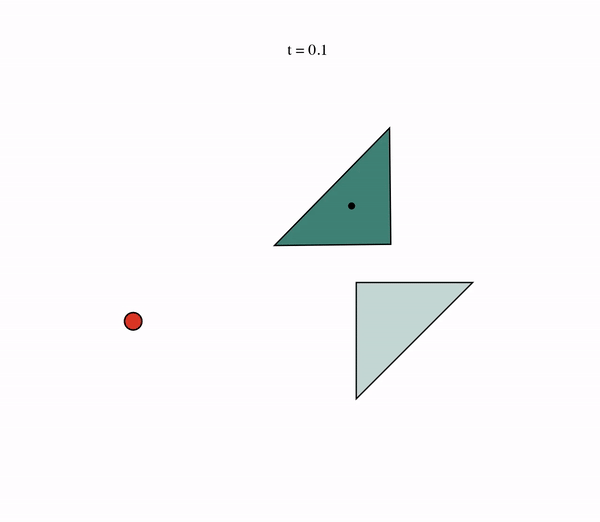
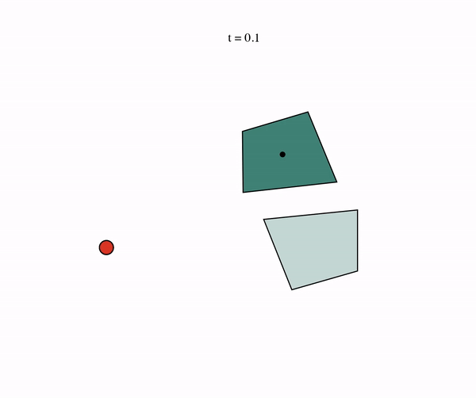
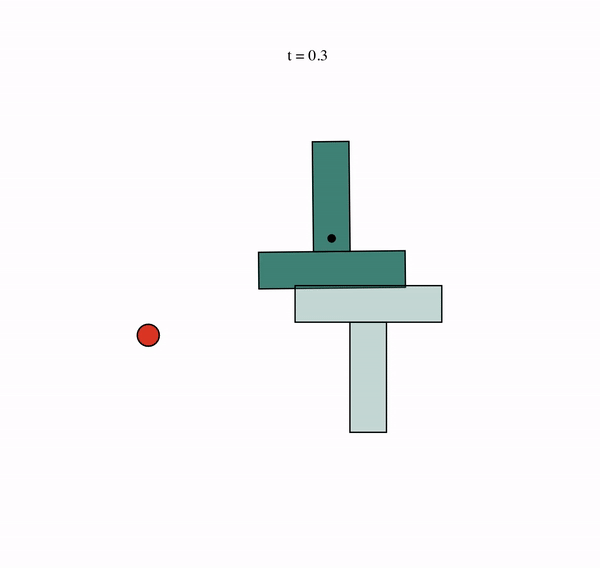
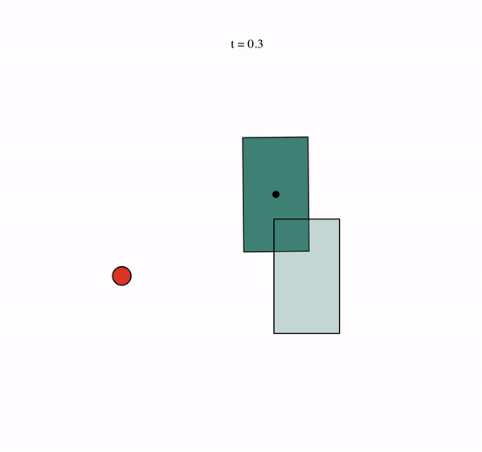

# MPC for Planar Pushing

This is an MPC implementation of the [GCS-based planar-pushing planner developed by Bernhard Paus Graesdal](https://bernhardgraesdal.com/rss24-towards-tight-convex-relaxations/). This can be paired with any simulator or hardware to generate and accurately follow planar pushing plans like the following:

<p align="center">
  
  
  
</p>

Note that this is not a true Markovian MPC -- for the sake of runtime, the mode sequence is planned only once at the start of the episode (or twice if `double_plan` is `True`) and then fixed during the rest of the episode.


## 🚀 Installation (Linux and MacOS)

This repo uses Poetry for dependency management. To setup this project, first
install [Poetry](https://python-poetry.org/docs/#installation) and, make sure
to have Python3.12 installed on your system.

Then, configure poetry to setup a virtual environment that uses Python 3.12:

```console
poetry env use python3.12
```

Next, install all the required dependencies to the virtual environment with the
following command:

```console
poetry install -vvv
```

(the `-vvv` flag adds verbose output).

For debug features to work, make sure to have graphviz installed on your computer. On MacOS, run the following
command:

```console
brew install graphviz
```

### Activating the environment

To activate the environment, run:

```console
source "$(poetry env info --path)/bin/activate"
```

To install the local `planning_through_contact` module, also run:

```
pip install -e .
```

---

## 🦾 Generating planar pushing plans

The main entrypoint for generating planar pushing plans is the following script:

```console
python scripts/planar_pushing/create_plans_simple.py
```

which will generate plans that look like this:

<p align="center">
  
</p>


## 🧠 Understanding the MPC implementation

The primary contribution of this work compared the [original planner developed by Bernhard Paus Graesdal](https://bernhardgraesdal.com/rss24-towards-tight-convex-relaxations/) are the following:
- The API in `gcs_planar_pushing/planning/planar/mpc.py`
- Modifications to the problem formulation to make it feasible amidst inaccuracies when following the plan closed-loop, including the following:
  - Softened slider target constraints (quadratic cost + bounding box constraint). This is necessary to allow the MPC to shoot for "best effort" when hitting the target exactly is not possible. 
  - Softened initial pusher constraint (quadratic cost + bounding box constraint). This is effective projects the pusher pose onto the contact manifold of the slider during contact modes. 
  - Softened rotational dynamics constraint during rounding. This reduces rounding solver failures.
- MPC-specific features:
  - Adding initial velocity constraint to the problem formulation so that MPC plans are consistent with the pusher's current velocity.
  - "Double Planning": since, for complex slider geometries, the limit surface friction approximation used by the planner is not accurate and causes a large dynamics gap, the initial mode sequence and plan is often not enough to get the slider close to the target. In such cases, if `double_plan` is `True`, then after the final contact mode, the MPC will generate another full plan (including contact sequence) and execute that, which is usually enough to get the slider very close to the target. This double plan has tighter constraints on the slider target pose, shorter contact modes (since only fine adjustments/small contacts are needed), and differently-tuned costs.
- Solver parameter tuning (particularly SNOPT's `"Scale option"`). This reduces rounding solver failures.


## ⚙️ Using the MPC API with a simulator or hardware

`PlanarPushingMPC` (implemented in `gcs_planar_pushing/planning/planar/mpc.py`) is the object you will generally interact with.

Construct `PlanarPushingMPC` like so: 

```python
config = get_default_plan_config(
    slider_type="arbitrary",
    arbitrary_shape_pickle_path=arbitrary_shape_pickle_path,
    pusher_radius=0.015 - PENETRATION_OFFSET,
    use_case="drake_iiwa",  # Define your own use case to tune model parameters to your/your simulator's taste
)
solver_params = get_default_solver_params()
start_and_goal = PlanarPushingStartAndGoal(
    slider_initial_pose=slider_start_pose,
    slider_target_pose=slider_goal_pose,
    pusher_initial_pose=pusher_start_pose,
    pusher_target_pose=pusher_goal_pose,
)

mpc_planner = PlanarPushingMPC(
  config=planner_config,
  solver_params=solver_params,
  start_and_goal=start_and_goal,
  planner_freq=10,  # Frequency of MPC planner in Hz
  double_plan=True,
  plan=True,
  output_folder="trajectories_mpc",  # Output folder for generated trajectory data and videos
  output_name=f"trajectory_trial_{i}",  # Folder (within `output_folder`) to store the data for this particular episode
  save_video=True,  # Save video of the generated plan
  interpolate_video=True,  # Interpolate between knot points in video visualization
)
```

The `PlanarPushingMPC` constructor generates the initial plan/mode sequence.

The recommended usage is to write your own `.pkl` files for the desired slider geometry in the `arbitrary_shape_pickles` directory. 

Within your 10 Hz planning loop, call the `plan` function:

```python
traj, traj_cost = mpc_planner.plan(
  t=time_since_traj_start,
  current_slider_pose=current_slider_pose,
  current_pusher_pose=current_pusher_pose,
  current_pusher_velocity=current_pusher_vel,
  is_in_contact=detected_contact,
  rounded=True,
  success=success,
  save_video=True,  # True for debugging; however, this slows the planner down a lot (and accumulates a ton of videos), so recommended to set to False (and remove the below options) during normal running.
  save_unrounded_video=True,
  output_folder="trajectories_mpc",
  output_name=f"trajectory_trial_{i}_timestep_{j}",
)
plan_time = time.time()
```

This uses the updated pusher and slider poses to update the plan (in accordinace with the original plan's mode sequence).

At a much higher frequency (i.e. 1000 Hz), update the target for your lower-level (i.e. Diff IK) controller:

```python
time_in_traj_to_retrieve_action = time.time() - plan_time + EXECUTION_LATENCY
action = traj.get_pusher_planar_pose(time_in_traj_to_retrieve_action).vector()[:2]

pusher_penetration_offset = (
    self.traj.get_pusher_planar_pose(0).vector()[:2] - current_pusher_pose.vector()[:2]
)  # Difference between actual current pusher pose and generated plan's initial pusher pose
action -= pusher_penetration_offset
```

Notes:
- The `rounded` option determines whether to use the rounded solution or the solution to the relaxed GCS problem. While `rounded=False` produces less accurate solutions, I have personally found that this is more reliable; setting `rounded=True` for some reason seems cause more solver failures on the relaxed problem in subsequent planning steps. 
- You must be able to provide a boolean flag `detected_contact` for whether the pusher and slider are currently in contact. This assists the planner in determining what mode it is currently in.
- If you set `double_plan` to `True`, you must be able to provide a boolean flag `success` for whether the slider has been "successfully" pushed (i.e. within some user-decided tolerance of the success pose). This assists the planner in deciding whether the double plan is actually needed or if it can be skipped.
- For highest chances of success, set `EXECUTION_LATENCY` to the approximate lag/delay of the pusher behind its commanded pose. This matters -- it helps the pusher stay close its planned position which assists the planner in determining which mode it is currently in.
- A rather important detail when using a simulator like Drake is to set `PENETRATION_OFFSET`. Drake simulates hydroelastic contact, which results in the pusher and slider penetrate slightly during pushing. We model this by telling the planner the pusher radius is slightly smaller than it actually is. In my experience, `PENETRATION_OFFSET = 0.00025` (0.25mm) leads to most frequent success. 
- Before sending the action to your low-level controller, subtract a `pusher_penetration_offset`. To understand why this is needed, recall that that the optimization formulation doesn't strictly enforce that the initial pusher pose in the generated plan matches the actual current pusher pose. In fact, when in contact/penetration, the optimization will project the pusher pose onto the contact manifold, causing a significant difference between the initial pusher pose in the generated plan and the actual current pusher pose. If we command the pusher to follow the generated plan blindly, it will jumpy suddenly to match the generated plan's initial pose. Subtracting `pusher_penetration_offset` is a hack to re-align the initial pusher pose in the generated plan and the actual current pusher pose to prevent this jump.


Find an example integration for T-pushing with the [Drake simulator](https://drake.mit.edu/) in [this repository](https://github.com/Michaelszeng/diffusion-policy-drake/blob/master/planning_through_contact/simulation/controllers/gcs_planner_controller.py).
